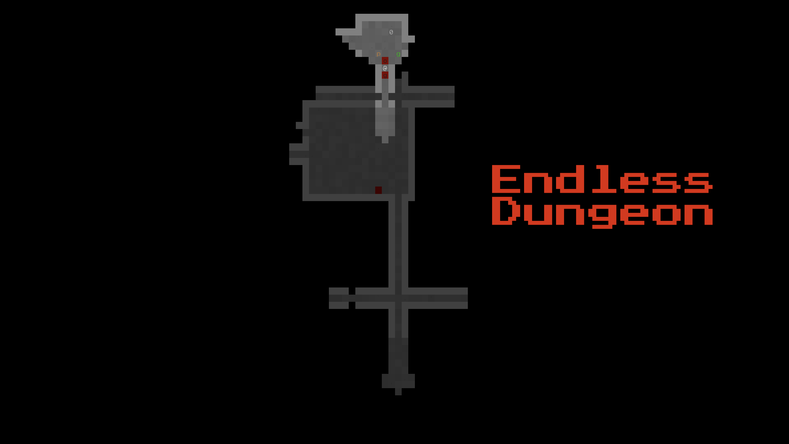

# Endless Dungeon

This is my project for 7DRL Challenge 2025

## Controls

- WEDCXZAQS - Movement keys (buttons around S)
- S - Idle
- F - pick item / use stairs
- YUIOP - use/equip items in inventory

## State of the game
This is the list of things I have implemented so far:
- Player creation and movement
- Basic enemy creatures (Kobold, Goblin, Orc, Troll)
- Inventory system with basic item management
- Combat system based on actions and priorities
- Attributes

This is the list of things which are not implemented or need improvement:
- Better map generation. This one is very basic
- Balance
- Better creature generator. Leveled creatures with equipment
- User interface improvements. Attributes and levelups are not displayed anywhere yet
- Main menu
- Save/load game functionality

#Tileset
Tileset from ./data belongs to Anniki. I got it from [here](https://dwarffortresswiki.org/Tileset_repository#8.C3.978)
You can use any tileset from there.

## Platforms
Although this project can be compiled for Windows, Linux, and MacOS using CMake and VCPKG package manager, I tested it only on __MacOS 14 Sonoma__

## Technical details
This project is based on this [libtcod C++ template](https://github.com/HexDecimal/libtcod-vcpkg-template)

I also used RogueBasin libtcod C++ tutorials to learn the basics of this library and C++.
